# SQLite schema reference

Operational data lives in SQLite. The **source of truth** for DDL is:

- `backend/app/database.py` — `init_db()` creates the core tables and indexes.
- `backend/alembic/versions/*.py` — incremental changes (e.g. `meta`, `prompt_override_examples`).

This page is a **human-readable map**; when in doubt, compare with the code above.

## Entity relationship (logical)

Solid relationship lines reflect `FOREIGN KEY` constraints in SQLite. Several integer columns (for example `knowledge_gaps.ticket_id`, `training_examples.ticket_id`, `prompt_overrides.eval_baseline_id`) are **logical** references to other tables and are not always enforced with FK syntax.

```mermaid
erDiagram
  users {
    int id PK
    string username
    string role
  }

  sessions {
    string id PK
    int user_id FK
  }

  chat_threads {
    int id PK
    int user_id FK
  }

  chat_messages {
    int id PK
    int thread_id FK
  }

  tickets {
    int id PK
    string status
    int created_by_user_id
  }

  resolution_notes {
    int id PK
    int ticket_id FK
  }

  classification_overrides {
    int id PK
    int ticket_id FK
  }

  knowledge_gaps {
    int id PK
    int ticket_id
  }

  training_examples {
    int id PK
    string correction_type
    int ticket_id
    int user_id
  }

  training_question_prompt_events {
    int id PK
    int training_example_id FK
    int override_id
  }

  eval_runs {
    int id PK
    string status
  }

  prompt_overrides {
    int id PK
    string status
    int eval_baseline_id
    int eval_after_id
  }

  prompt_override_examples {
    int override_id PK
    int example_id PK
  }

  prompt_suggestion_decisions {
    int id PK
    string decision
  }

  prompt_override_audit {
    int id PK
    int override_id
  }

  prompt_analysis_cache {
    string cache_key PK
  }

  llm_model_profiles {
    int id PK
    string name
  }

  llm_task_defaults {
    string task PK
    int profile_id FK
  }

  meta {
    string key PK
    string value
  }

  users ||--o{ sessions : "session"
  users ||--o{ chat_threads : "threads"
  chat_threads ||--o{ chat_messages : "messages"
  tickets ||--o{ resolution_notes : "notes"
  tickets ||--o{ classification_overrides : "overrides"
  training_examples ||--o{ training_question_prompt_events : "quality events"
  llm_model_profiles ||--o{ llm_task_defaults : "task default"
  prompt_overrides ||--o{ prompt_override_examples : "M:N"
  training_examples ||--o{ prompt_override_examples : "M:N"
```

## Tables (summary)

| Table | Role |
| --- | --- |
| `users` | Accounts (`admin` / `user`), password hash, optional `email`. |
| `sessions` | Cookie/session records; FK to `users`. |
| `chat_threads` | Per-user conversation threads. |
| `chat_messages` | Messages (`user` / `assistant`) in a thread. |
| `tickets` | FM work tickets derived from chat / classification. |
| `resolution_notes` | Notes and resolution metadata per ticket. |
| `classification_overrides` | Manager corrections vs model output per ticket field. |
| `knowledge_gaps` | Captured gaps; `ticket_id` is optional (no FK in schema). |
| `training_examples` | Training-quality rows: inputs, model JSON, review state, payloads, optional `ticket_id` / `user_id` (logical, not FK-enforced). |
| `eval_runs` | Batch eval runs and aggregate metrics. |
| `prompt_overrides` | Approved prompt-rule changes; lifecycle and eval linkage. |
| `prompt_override_examples` | Junction: which `training_examples` an override affects. |
| `prompt_suggestion_decisions` | Accept/reject log for analyzer suggestions. |
| `prompt_override_audit` | Audit trail for override actions (apply, rollback, etc.). |
| `prompt_analysis_cache` | Cached analyzer JSON by cache key. |
| `training_question_prompt_events` | Fine-grained events linking examples, overrides, analysis keys. |
| `llm_model_profiles` | Stored LLM provider profiles (encrypted key material). |
| `llm_task_defaults` | Which profile backs each named task. |
| `meta` | Key/value (`rules_version`, `db_salt`, etc.). |

## Indexes and constraints (high level)

- `training_examples`: unique partial index on `(source_type, source_id, source_ref)` when `source_id != ''`; indexes on `correction_type`, `normalized_input`.
- `prompt_overrides`: index on `status`.
- `eval_runs`: index on `status`.
- `training_question_prompt_events`: dedup unique index on `(training_example_id, event_type, analysis_cache_key)` when cache key present.
- `chat_threads` / `chat_messages`: indexes for listing by user and thread ordering.

See `init_db()` in `database.py` for the full list.

## Chroma

Vector chunks and embeddings are **not** in SQLite. They live under `CHROMA_DIR` (see config / `.env`). Ingest is `python -m app.ingest` (or `docker compose exec backend python -m app.ingest`).
