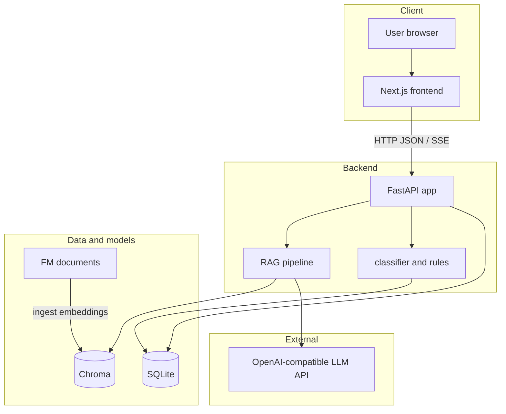
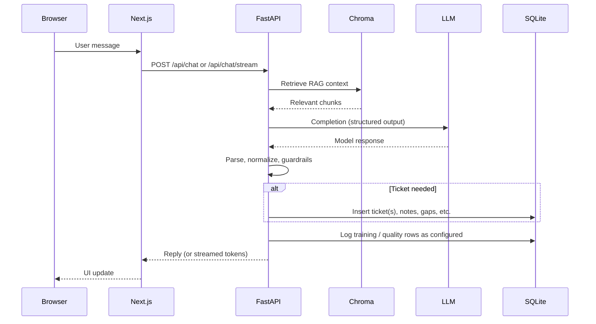

# Architecture and request flow

This is the **canonical** description of how FM Chatbot fits together. Other docs link here instead of duplicating the narrative.

## System context

## Chat request flow

Typical path for `/api/chat` or `/api/chat/stream`:

## Where to read more

- **HTTP API (live)**: [OpenAPI / interactive docs](#openapi) — run the backend and open `/docs` or `/redoc`.
- **SQLite schema**: [`docs/schema.md`](schema.md) (tables, keys, relationships; code source of truth remains `backend/app/database.py` plus `backend/alembic/versions/*`).
- **Module map**: [`docs/README_developers.md`](README_developers.md) — “Main backend modules” and “Where to change behavior”.

## OpenAPI

FastAPI exposes the generated contract at:

- **Swagger UI**: `http://localhost:8000/docs`
- **ReDoc**: `http://localhost:8000/redoc`
- **OpenAPI JSON**: `http://localhost:8000/openapi.json`

With Docker Compose (default ports), use the same paths on port **8000** on the host.

Prefer these URLs over static endpoint lists in markdown: the live spec stays accurate as routes change.
